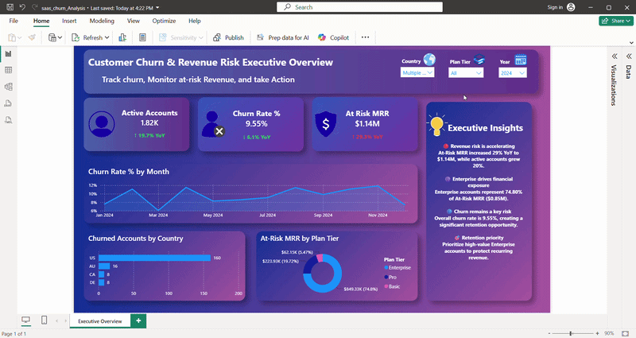
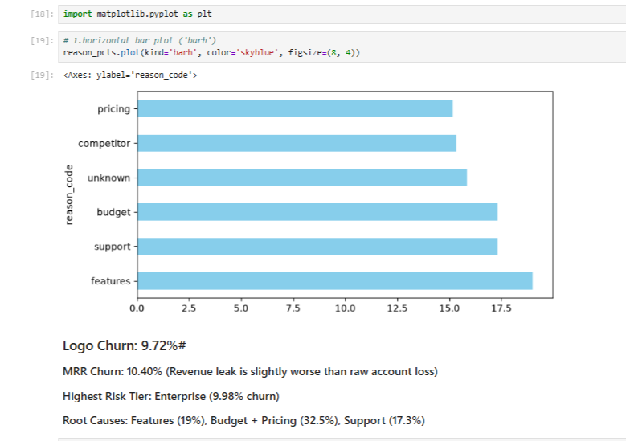
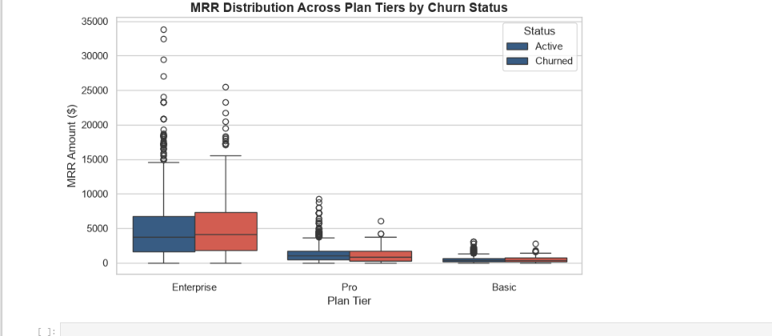
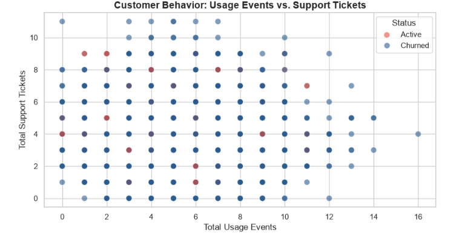

# Saas-customer-churn-revenue-risk-analysis
End-to-end SaaS customer churn and revenue risk analysis using Python, Pandas, and Power BI to identify churn trends, At-Risk MRR, high-value customer segments, and retention priorities.


<!-- 🎥 DASHBOARD INTERACTIVE DEMO 🎥 -->


## 🎯 Project Overview & Business Objectives

In B2B SaaS models, customer retention directly dictates long-term enterprise valuation and Monthly Recurring Revenue (MRR) predictability. This project processes 5,000 customer accounts across 5 relational tables to evaluate churn drivers, revenue exposure, and usage metrics, converting descriptive statistics into proactive retention strategies.

### Primary Goals
1. **Financial Exposure Modeling:** Determine if account loss is aligned with MRR loss, or if high-value Enterprise accounts are driving revenue leakage.
2. **Root-Cause Root Analysis:** Pinpoint specific customer friction points regarding feature caps, pricing structures, and support interactions.
3. **Behavioral Early Warning System:** Create an automated action pipeline to isolate active accounts showing warning signs (low usage + open support tickets) before they cancel.

---

## 🖥️ Executive Dashboard Highlights & Insights (Power BI)

The interactive Executive Overview focuses on 2024 performance, summarizing the health of **2.44K Active Accounts** against **$1.47M in total At-Risk MRR**.

### Key Dynamic Visuals
* **At-Risk MRR by Plan Tier (Donut Chart):** Crucial revenue dispersion. **Enterprise accounts drive 73.17% ($1.08M)** of total exposed recurring revenue, requiring white-glove retention workflows for top-tier clients.
* **Churned Accounts by Country (Horizontal Bar Chart):** Identifies geographical concentration, with the **United States (160 churned accounts)** and **United Kingdom (40)** leading global cancellations.
* **Churn Rate Trends by Month (Area Chart):** Monitors retention stability throughout 2024, highlighting peaks in Q1 and late Q4.
* **Executive Summary Panel:** Translates live data filters into immediate actionable strategic priorities.

---

## 🐍 Exploratory Data Analysis & Python Visualizations

Deep-dive statistical analysis was conducted using `pandas`, `seaborn`, and `matplotlib` on the integrated 27-column master dataset.

### 1. The Churn Dichotomy: Logo vs. Revenue exposure
We isolated the critical SaaS metric difference: **Logo Churn Rate (9.72%)** vs. **MRR Churn Rate (10.40%)**.
* *Insight:* Because MRR Churn exceeds Logo Churn, our revenue loss is concentrated in larger customer contracts.

### 2. Identifying Root Causes of Churn (Matplotlib)
Combining budget constraints ($17.3\%$) and pricing friction ($15.2\%$) reveals that **financial concerns drive 32.5% of all cancellations**, while missing product features represents the single largest individual driver ($19.0\%$).




### 3. MRR Distribution by Plan Tier (Seaborn Boxplot)
The Enterprise segment shows extreme variance and high MRR outliers. Losing a single outlier Enterprise account significantly impacts total MRR unpredictably.



### 4. Behavior: Usage Events vs. Support Tickets (Seaborn Scatter)
 mapped account engagement. Churned accounts (blue) are distributed across all usage tiers, confirming that attrition is driven by feature fit and pricing rather than passive platform ghosting.



---

## 🚀 Proactive Strategy Deliverables & Impact

Using statistical filters derived from the EDA, this project generated tangible business outputs for Customer Success teams:

1. **High-Risk Action List:** Dynamic export of **1,205 active accounts** currently showing early warning behavioral indicators ($\le 3$ usage events combined with open support tickets).
2. **Revenue Guardrail:** Directing outreach toward this priority list immediately protects **$2.65M in active MRR** currently exposed to churn risk.

---

## 📁 Repository Structure

```text
Saas-customer-churn-revenue-risk-analysis/
│
├── analysis/               # SQL scripts or additional analytical queries
├── cleaned_data/           # Output datasets (df_master_powerbi.csv, high_risk_accounts_action_list.csv)
├── data/                   # Raw source CSV files
├── notebooks/              # Jupyter Notebook (.ipynb)
├── screenshots/            # Dashboard GIFs, Python visualizations (boxplot, scatter, bar charts)
│   └── dashboard_demo2.gif
└── README.md               # Full repository documentation
